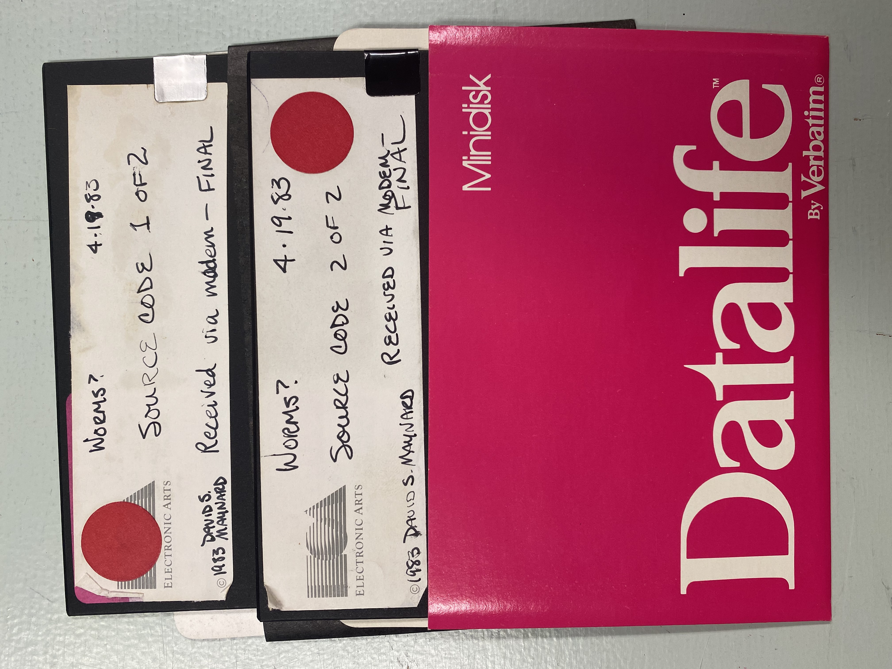
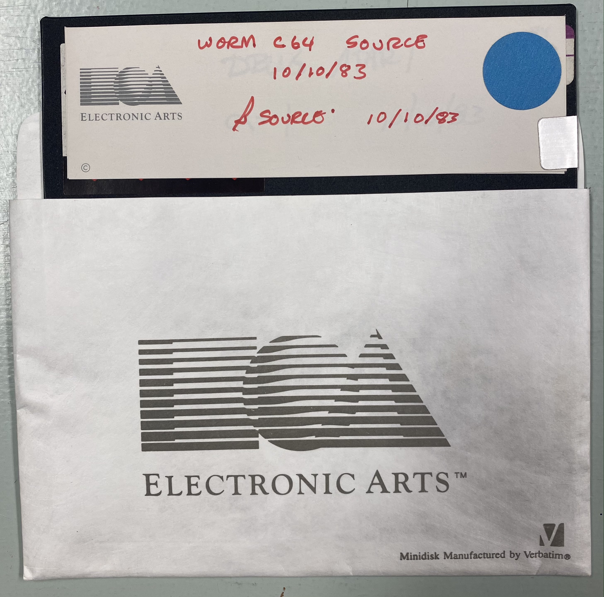

[![Badge License]][License]

<br>

<div align = center>

# Worms?

Source code for **[Worms?]** by **[David S. Maynard]** from his original<br>
floppies, available for the  `Atari 8-bit`  and  `Commodore 64` .

<br>
<br>
    
[![Button Gameplay]][Gameplay]   
[![Button Notes]][Notes]   
[![Button Scanned]][Scanned]   
[![Button Darworms]][Darworms]

<br>
<br>

*He generously released the code under **MIT** license.*

<br>
<br>

##  Atari 8-bit

<kbd>  1983 / 04 / 19  </kbd>

<br>



<br>

| Part | Forth Source        | Atari Image     
|:----:|:-------------------:|:-------------------:
| Ａ   | [📂][Forth Atari A] | [💾][Image Atari A] 
| Ｂ   | [📂][Forth Atari B] | [💾][Image Atari B] 

<br>

*The **FORTH** disk images are not bootable.*
    
</div>
    
<br>
<br>
<br>

### Instructions

1. Load **[ValForth]**

2. Switch to the source disk

3. Type 

    ```atari
    LIST <Screen Number>
    ```

<br>
<br>
<br>

<div align = center>

## Commodore 64

<br>



<br>

| Forth Source          | D64 Image     
|:---------------------:|:----------------------:
| [📂][Forth Commodore] | [💾][Image Commodore] 

<br>
    
*The **FORTH** disk image is not bootable and does* <br>
*not use a standard **Commodore** disk structure.*

</div>
    
<br>
<br>

### Details

`EAFORTH`  &  `SYSTEM`  are fake files.

`EAFORTH`  was probably a proprietary / custom<br>
version of the language used at **Electronics Arts**.

<br>


<!----------------------------------------------------------------------------->

[David S. Maynard]: https://github.com/dmaynard/ 'David S. Maynards GitHub Profile'
[ValForth]: http://www.atarimania.com/utility-atari-400-800-xl-xe-valforth_17605.html
[Gameplay]: https://www.youtube.com/watch?v=Y4JASQ7EsFY 'Showcase of Worms? Gameplay' 
[Darworms]: https://github.com/dmaynard/Darworms 'Javascript Reproduction of Worms? by David S. Maynard'
[Scanned]: https://archive.org/details/worms-source-code 'Archive of the Scanned Source Code'
[Worms?]: https://en.wikipedia.org/wiki/Worms%3F 'Wikipedia Article on Worms?'
[Notes]: https://archive.org/details/david-maynard-worms-development-notes 'Archive of the Development Notes'

[License]: LICENSE


<!-------------------------------{ Source Code }------------------------------->

[Forth Commodore]: Source/Commodore/Worms.forth
[Forth Atari A]: Source/Atari/A.forth
[Forth Atari B]: Source/Atari/B.forth


<!------------------------------{ Disk Images }-------------------------------->

[Image Commodore]: Binaries/Commodore.d64
[Image Atari A]: Binaries/Atari/A.ATR
[Image Atari B]: Binaries/Atari/B.ATR


<!--------------------------------{ Badges }----------------------------------->

[Badge License]: https://img.shields.io/badge/License-MIT-ac8b11.svg?style=for-the-badge&labelColor=yellow


<!-------------------------------{ Buttons }----------------------------------->

[Button Gameplay]: https://img.shields.io/badge/Gameplay-yellow?style=for-the-badge&logoColor=white&logo=AppleArcade
[Button Darworms]: https://img.shields.io/badge/Darworms-orange?style=for-the-badge&logoColor=white&logo=CommonWorkflowLanguage
[Button Scanned]: https://img.shields.io/badge/Scanned_Code-52819d?style=for-the-badge&logoColor=white&logo=Slack
[Button Notes]: https://img.shields.io/badge/Development_Notes-6b9d52?style=for-the-badge&logoColor=white&logo=GitBook
